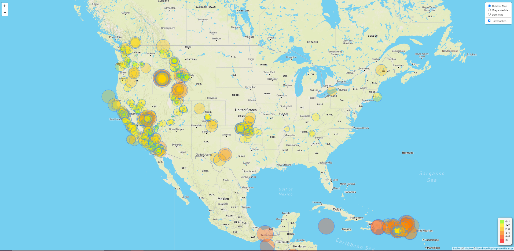
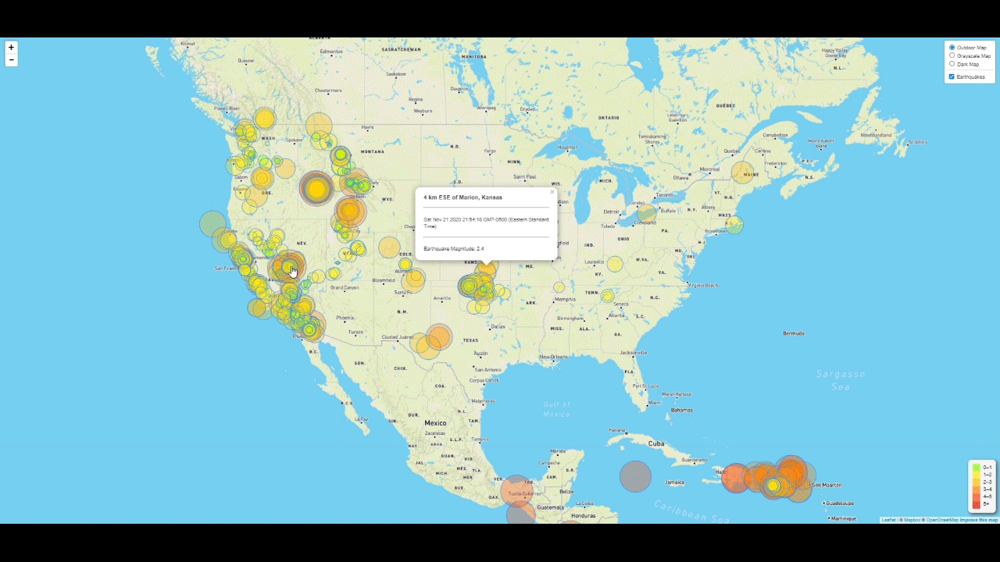
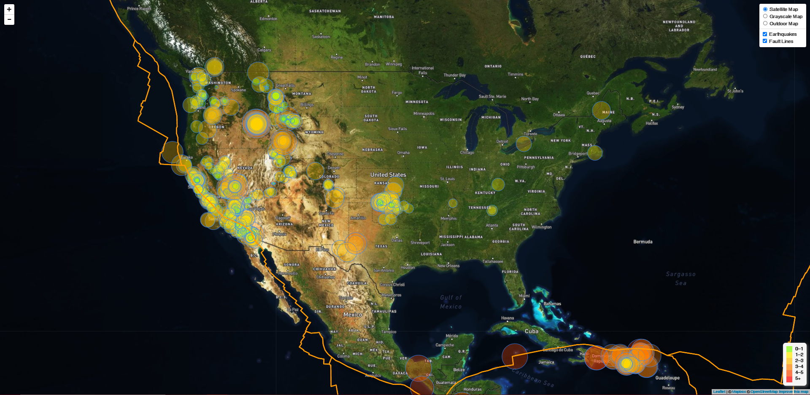
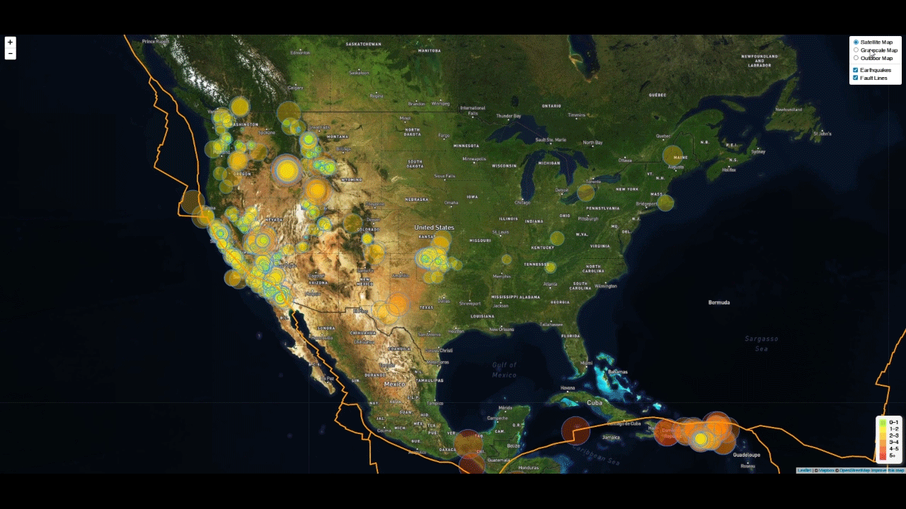

# Leaflet.js Challenge Work 

# Introduction Of The Project Work:

Welcome to the United States Geological Survey, or USGS for short! The USGS is responsible for providing scientific data about natural hazards, the health of our ecosystems and environment; and the impacts of climate and land-use change. Their scientists develop new methods and tools to supply timely, relevant, and useful information about the Earth and its processes. As a new hire, you will be helping them out with an exciting new project!

The USGS is interested in building a new set of tools that will allow them visualize their earthquake data. They collect a massive amount of data from all over the world each day, but they lack a meaningful way of displaying it. Their hope is that being able to visualize their data will allow them to better educate the public and other government organizations (and hopefully secure more funding..) on issues facing our planet.

## My Work Includes:

### Step 1: Create Basic Visualization For Earthquake Data Set.

* Get your data set ready for visualization 

* Import & Visualize the Data 

* To see the visualization on live, follow this link: https://vimeo.com/484947107

### Step 2: More Data To Discover 

* Illustrate the relationships between tectonic plates and seismic activity. 

* Compare and contrast these relationships along with the original data set created from the first map.

* To see the visualization on live, follow this link: https://vimeo.com/484947183 

Erika Yi © 2020. All Rights Reserved. 